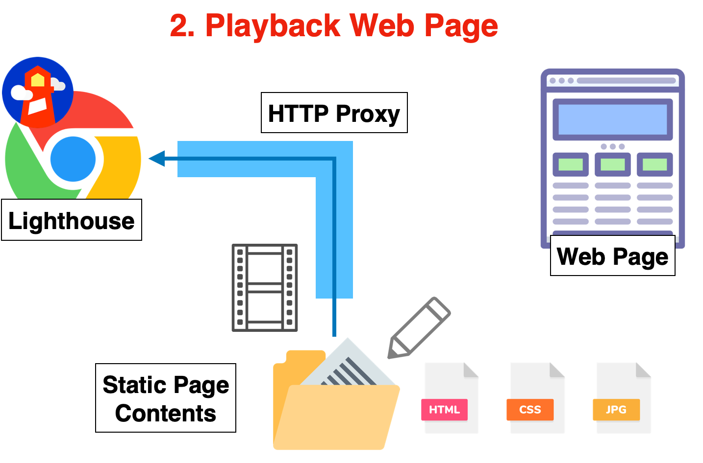

| [日本語](./README.ja.md) | [English](./README.md) |

# PageSpeed Quest

PageSpeed Quest is a framework to assist in improving the speed of web frontend.

There are numerous methods and ideas to enhance the speed of a web frontend, including the fix of bottlenecks. However, even if theoretically effective methods are implemented in applications, the expected results are often not achieved.

By utilizing PageSpeed Quest, you can rapidly iterate on the hypothesis testing of methods and prioritize the implementation of effective ideas.

## Mechanism

Those who are familiar with the Web API mocking tool [VCR](https://github.com/vcr/vcr) can understand it as an extension of that tool for web pages.

[Lighthouse](https://developer.chrome.com/docs/lighthouse/overview/) is executed via an HTTP proxy provided by PageSpeed Quest. This HTTP proxy not only relays between the web server and Lighthouse but also "records" web page resources by converting them into a set of files like static pages. The proxy is powered by [rust-http-playback-proxy](https://github.com/ideamans/rust-http-playback-proxy), a high-performance Rust-based native module.


From then on, instead of accessing the web server, the server's response is "played back" using the recorded static files. During this, the latency and throughput of each resource traffic are reproduced as much as possible.



Thanks to this mechanism, instead of actually modifying the application, you can quickly test the impact on measurement results by only changing the set of static files.

## How to use

Node JS 20 or higher is required.

### Creating a project

First, create a project to proceed with hypothesis testing. Change the directory name as needed.

```sh
mkdir my-first-quest
cd my-first-quest
yarn init -y
yarn add pagespeed-quest -D
```

### Recording a web page

Run Lighthouse with the following command and record the files needed for measurement. Please change the URL.

```sh
yarn psq lighthouse recording https://example.com/
```

Files are created in the `inventory` directory.

- `inventory/index.json` List of resources and metadata
- `inventory/contents/[method]/[protocol]/[hostname]/[...path]` Content of each resource

By modifying these files, you can change the resources, metadata, and transfer speed that Lighthouse receives in the playback operation explained next.

### Playback and measurement of the web page

Play back the web page with the following command and measure it with Lighthouse.

```sh
yarn psq lighthouse playback
```

A report page is automatically displayed. Report files and the like are created in the `artifacts` directory.

### Creating a video of the loading process with loadshow

By using the following `loadshow` subcommand, you can output the playback process of a loaded web page as a video using [loadshow](https://github.com/ideamans/go-loadshow).

```sh
yarn psq loadshow playback
```

The video will be output as `artifacts/loadshow.mp4`.

You can also use loadshow to record the loading of a web page.

```sh
yarn psq loadshow recording https://example.com/
```

Lighthouse and loadshow behave slightly differently when it comes to how the browser handles web page loading.

If the main goal is to check speed improvements through video, it is recommended to use the `loadshow recording` subcommand.

### Capturing a screenshot and visual comparison

You can capture a screenshot of the playback page using the `capture` subcommand. This launches the playback proxy in full-throttle mode (no timing simulation) and takes a screenshot with [static-webshot](https://github.com/ideamans/static-webshot). The screenshot is rendered at 400x1600 viewport and resized to 200x800.

```sh
yarn psq capture
```

The screenshot will be saved as `artifacts/capture.png`.

To compare with a previous screenshot, specify the baseline image with `--compare`:

```sh
yarn psq capture --compare baseline.png
```

This generates a diff image at `artifacts/capture-diff.png` and a summary at `artifacts/capture-diff.txt`. You can customize the labels with `--baseline-label` and `--current-label`.

```sh
yarn psq capture --compare baseline.png --baseline-label "Before" --current-label "After"
```

## Launching the proxy

You can launch the proxy with the following command.

### Playback mode

```sh
yarn psq proxy -p 8080
```

The proxy watches the inventory directory for changes and automatically restarts when files are modified.

### Recording mode

You can also start the proxy in recording mode to capture web page resources:

```sh
yarn psq proxy -p 8080 --record https://example.com/
```

Press `Ctrl+C` to stop recording and save the inventory.

### Using the proxy with a browser

By setting the HTTP proxy of a regular browser to `http://localhost:8080`, you can closely observe the performance timeline in developer tools.

However, since this HTTP proxy uses a dummy SSL certificate, please disable the browser's SSL certificate error check. For example, on macOS, you can launch Chrome with the HTTP proxy set to `http://localhost:8080` and the SSL certificate error check disabled with the following command.

```sh
/Applications/Google\ Chrome.app/Contents/MacOS/Google\ Chrome --ignore-certificate-errors --proxy-server=http://localhost:8080
```

## For Sharing Development Environments and Training

PageSpeed Quest is useful not only for speedy hypothesis verification without the need for a Web application release but also for other purposes.

- `Third-party Collaboration`: There may be times when it is difficult to share the development environment when seeking the cooperation of third parties. You can easily share a virtual development environment for the Web frontend.
- `Training`: Not just for your own site, but you can train to improve the speed of any Web page's frontend.

## Contact

For technical support or business use, please contact <contact@ideamans.com>.
