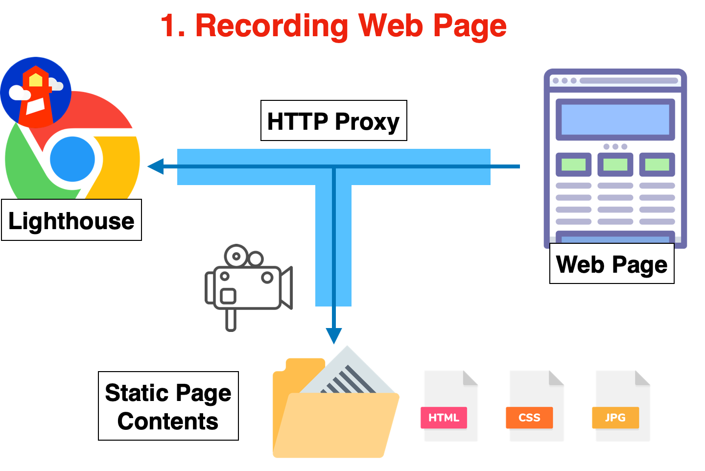

| [日本語](./README.ja.md) | [English](./README.md) |

# PageSpeed Quest

PageSpeed Quest is a framework to assist in improving the speed of web frontend.

There are numerous methods and ideas to enhance the speed of a web frontend, including the fix of bottlenecks. However, even if theoretically effective methods are implemented in applications, the expected results are often not achieved.

By utilizing PageSpeed Quest, you can rapidly iterate on the hypothesis testing of methods and prioritize the implementation of effective ideas.

## Mechanism

Those who are familiar with the Web API mocking tool [VCR](https://github.com/vcr/vcr) can understand it as an extension of that tool for web pages.

[Lighthouse](https://developer.chrome.com/docs/lighthouse/overview/) is executed via an HTTP proxy provided by PageSpeed Quest. This HTTP proxy not only relays between the web server and Lighthouse but also "records" web page resources by converting them into a set of files like static pages.



From then on, instead of accessing the web server, the server's response is "played back" using the recorded static files. During this, the latency and throughput of each resource traffic are reproduced as much as possible.


Thanks to this mechanism, instead of actually modifying the application, you can quickly test the impact on measurement results by only changing the set of static files.

## How to use

Node JS 18 or higher is required.

### Creating a project

First, create a project to proceed with hypothesis testing. Change the directory name as needed.

```sh
mkdir my-first-quest
cd my-first-quest
yarn init -y
yarn add pagespeed-quest -D
```

### Recording a web page

Run Lighthouse with the following command and record the files needed for measurement. Please change the URL.

```sh
yarn psq lighthouse recording https://example.com/
```

Files are created in the `inventory` directory.

- `inventory/index.json` List of resources and metadata
- `inventory/[method]/[protocol]/[hostname]/[...path]` Content of each resource

By modifying these files, you can change the resources, metadata, and transfer speed that Lighthouse receives in the playback operation explained next.

### Playback and measurement of the web page

Play back the web page with the following command and measure it with Lighthouse.

```sh
yarn psq lighthouse playback
```

A report page is automatically displayed. Report files and the like are created in the `artifacts` directory.

## Launching the playback proxy

You can launch only the proxy that plays back the web page with the following command.

```sh
yarn psq proxy -p 8080
```

By setting the HTTP proxy of a regular browser to `http://localhost:8080`, you can closely observe the performance timeline in developer tools.

However, since this HTTP proxy uses a dummy SSL certificate, please disable the browser's SSL certificate error check. For example, on MacOS, you can launch Chrome with the HTTP proxy set to `http://localhost:8080` and the SSL certificate error check disabled with the following command.

```sh
/Applications/Google\ Chrome.app/Contents/MacOS/Google\ Chrome --ignore-certificate-errors --proxy-server=http://localhost:8080
```

## For Sharing Development Environments and Training

PageSpeed Quest is useful not only for speedy hypothesis verification without the need for a Web application release but also for other purposes.

- `Third-party Collaboration`: There may be times when it is difficult to share the development environment when seeking the cooperation of third parties. You can easily share a virtual development environment for the Web frontend.
- `Training`: Not just for your own site, but you can train to improve the speed of any Web page's frontend.

## Contact

For technical support or business use, please contact <contact@ideamans.com>.
